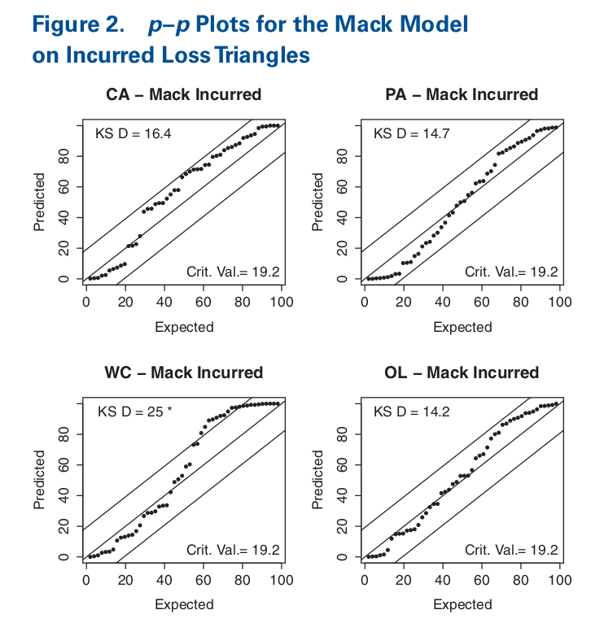

```{r include=FALSE}
suppressPackageStartupMessages({
    library(cellar)
    library(ChainLadder)
    library(patchwork)
    library(tidyverse)
    library(gt)
    
})

source(here::here("R", "02_utils.R"))
source(here::here("R", "03_plots.R"))


```

## Step 1 - Let's get some data

```{r}

schedule_p <- cellar_pull("schedule_p")

glimpse(schedule_p)

```

## Step 2 - Restrict the data to what Meyer's used in his analysis.

```{r}
# See R/01_data_selection.R for references to Meyer's payper
selected_groups <- readRDS(here::here("cache/selected_groups.rds"))

lob_data <- schedule_p %>%
    inner_join(selected_groups, by = c("lob", "group_code")) %>%
    group_by(lob)

analysis_data <- group_split(lob_data)

lobs_keys <- group_keys(lob_data)

```


```{r}
count_unique_group_codes <- function(tbl) {
    tbl %>%
        group_by(group_code) %>%
        count() %>%
        nrow()
}

num_groups <- map_int(analysis_data, count_unique_group_codes)

error_check_tbl <- lobs_keys %>%
    mutate(num_groups = num_groups)

gt(error_check_tbl)
```

## Step 3 - Apply Mack Method to all data in each lob

This is leveraging functions from the ChainLadder R package.

  Markus Gesmann, Daniel Murphy, Yanwei (Wayne) Zhang, Alessandro Carrato,
  Mario Wuthrich, Fabio Concina and Eric Dal Moro (2020). ChainLadder:
  Statistical Methods and Models for Claims Reserving in General Insurance. R
  package version 0.2.11. https://github.com/mages/ChainLadder#chainladder

```{r}
apply_mack_to_lob <- function(x) {
    calc_mack_safely <- purrr::safely(calc_mack_estimates)
    
    mack_data <- x %>% 
        group_by(group_code) %>%
        group_split() %>%
        map(calc_mack_safely)
    
    num_without_error <- mack_data %>% 
        map_dbl( ~ is.null(.x$error)) %>% 
        sum()


    list(
        results = map_dfr(mack_data, ~ .x$result),
        num_without_error = num_without_error
    )
}

mack_results <- map(analysis_data, apply_mack_to_lob)


```


#### Confirm that there were no errors in applying the Mack model.


```{r}
error_check_tbl %>%
    bind_cols(
        num_correct = map_dbl(mack_results, pluck, "num_without_error")
    ) %>%
    mutate(
        num_errors = num_groups - num_correct,
        error_rate = num_errors / num_groups
        ) %>%
    select(lob, num_groups, num_errors, error_rate) %>%
    gt() %>%
    cols_align(align = "center", columns = c(2:4)) %>%
    fmt_percent(columns = 4, decimals = 1)

```

## Step 4 - Evaluate the Model

```{r}
pp_plots <- map2(mack_results, lobs_keys$lob, ~ make_pp_plot(.x$results, .y))

```
### My PP Plots
```{r}

pp_plots[[1]] + pp_plots[[3]] + pp_plots[[4]] + pp_plots[[2]] + plot_layout(nrow = 2)
```

### Here's what's in Meyer's paper



### Kolmogorov–Smirnov (K–S) test


```{r}
# critical value from the Kolmogorov distribution at 5% confidence level (Meyers pg 8)
KS_critical_value <- 1.36 / sqrt(50) #  0.192333

KS_test_statistics <- map(mack_results, pluck, "results", "percentile") %>%
    map_dbl(meyers_ks_test)

lobs_keys %>%
  mutate(
    ks_stat = KS_test_statistics,
    reject_null = ks_stat > KS_critical_value
  ) %>%
  gt()
```

